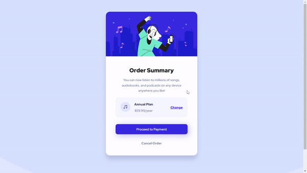

# Frontend Mentor - Order summary card solution

This is a solution to the [Order summary card challenge on Frontend Mentor](https://www.frontendmentor.io/challenges/order-summary-component-QlPmajDUj).

## Table of contents

- [Overview](#overview)
  - [The challenge](#the-challenge)
  - [Preview](#preview)
  - [Links](#links)
- [My process](#my-process)
  - [Built with](#built-with)
- [Author](#author)

## Overview

### The challenge

Users should be able to:

- See hover states for interactive elements

### Preview

### Links

- Solution URL: [Source Code](https://github.com/rwsaraujo/order-summary-component)
- Live Site URL: [Live Site](https://order-summary-component-flame-nu.vercel.app/)

## My process

### Built with

- HTML5
- SCSS

## Author

- Website - [araujowebdev](https://rwsaraujo.github.io/araujowebdev/)
- Frontend Mentor - [@rwsaraujo](https://www.frontendmentor.io/profile/rwsaraujo)
- Twitter - [@rwsaraujo](https://www.twitter.com/rwsaraujo)
